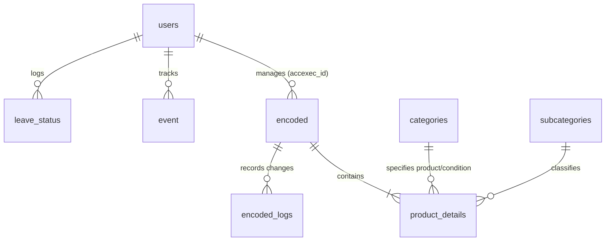

# Electronic Daily Sales Report (E-DSR) - Version 2.0

E-DSR is a secure, role-based database web application designed to digitalize daily sales reporting, coordinate lead activities, and monitor pipeline health for business operations. Built on a PHP backend and MySQL database, it provides real-time sales dashboards, granular activity registration, performance analytics, and administrative management portals.

---

## 🛠️ Tech Stack & Technologies

### 1. Frontend
* **Core Structure**: HTML5 with semantic layouts.
* **UI/Styling Framework**: **Bootstrap 5** (v5.3.2 & v5.0.2) for responsive styling and component patterns.
* **Typography & Icons**: **Google Fonts (Inter)** for clean reading and **Font Awesome 6** for interactive visual cues.
* **Visual Data Charts**: **Chart.js** for rendering interactive dashboard metrics (e.g., Daily Call charts).
* **Calendar Integration**: **FullCalendar 5** for company calendars, training events, and reminder schedules.
* **Interactivity**: **jQuery 3.6** and Vanilla JavaScript for AJAX calls, responsive selector adjustments (e.g., matching branches to regional offices), address auto-completion, and dynamic form operations.
* **Utility Libraries**: **SheetJS (xlsx.full.min.js)** for processing spreadsheet actions.

### 2. Backend
* **Language & Server Environment**: **PHP 8.x** running under an Apache server environment (compatible with XAMPP).
* **Session Management**: Session cookies (`e-dsr-user` containing the user ID) coupled with server-side PHP sessions.
* **Security & Authentication**: Blowfish hashing (`password_hash` with `$2y$`) for user password security.
* **Data Integration**: Standard **MySQLi extension** for secure and efficient relational database connectivity.
* **Export Engine**: Custom PHP scripts to compile query results into downloadable CSV/Excel formats.

### 3. Database
* **Database Engine**: **MySQL / MariaDB** (InnoDB storage engine, `utf8mb4_general_ci` collation).
* **Relational Schema**: 10 interconnected tables representing users, activity records, products, holidays, and metadata options.

---

## 📂 Project Structure Map

```bash
e-dsr/
├── css/                   # Custom stylesheets (sidebar, table grids, dashboard views)
├── js/                    # Client-side validation, charts, calendar, and address selectors
│   ├── dashboard/         # Logic for the dashboard elements (Calendar & Daily Calls)
│   └── encode/            # Prefilling logic for the DSR encoding forms
├── pages/                 # UI pages loaded dynamically within the app layout
│   ├── dashboard/         # Sub-panels of the main BO Dashboard (KPI, Leaderboard, etc.)
│   └── modals/            # Bootstrap modals (add user, filters, update graphs, etc.)
├── php/                   # Server-side controllers, API query scripts, and DB connection
├── vendor/                # Autoloader directories (Composer skeleton setup)
├── index.php              # Standard entry page (Login Interface)
├── firstTimeLogin.php     # First-time access password configuration
├── edsr2 latest.sql       # Database schema initialization backup
└── README.md              # Project documentation
```

---

## 🔑 User Roles & Permissions
The system dynamically limits navigation links (via [header.php](file:///Applications/XAMPP/xamppfiles/htdocs/e-dsr/pages/header.php)) and filters SQL database views depending on the user's role:

| Role Category | Description | Primary Access |
| :--- | :--- | :--- |
| **Admin** | MIS / System Administrators | Complete control. Access to user management, leave administration, custom database categories, and global dashboards. |
| **Manager** | Team Leaders / Branch Heads | Access to team-wide activities, manager login timestamps, sales execution leaderboards, and approval summaries. |
| **User (Sales Executive)** | Field Representatives | Restricted to encoding personal daily activities, managing assigned accounts, and viewing personal dashboard metrics. |
| **VP / BO** | Executives / Business Operations | Read-only global visibility, access to settings, and comprehensive database exporting pipelines. |

---

## 🌟 Key Application Modules

### 1. Dashboard (Home)
Located at [welcome_page.php](file:///Applications/XAMPP/xamppfiles/htdocs/e-dsr/pages/welcome_page.php):
* **Reminders & Events Calendar**: Uses FullCalendar to display scheduled events, trainings, and deadlines.
* **Performance Indicators**: Quick-read metric cards summarizing F2F meetings, emails, phone calls, and closing conversion ratios.
* **Daily Activity Graph**: Chart.js visualization mapping calls and client visits against configured dates.

### 2. DSR Encoding Engine
Located at [encode.php](file:///Applications/XAMPP/xamppfiles/htdocs/e-dsr/pages/encode.php):
* A multi-segment wizard form detailing:
  1. **Pipeline Information**: SBU, Account Executive, Activity Date, and Team assignments.
  2. **Client Information**: Dynamic autocomplete for customer names, contract expirations, and industry classifications.
  3. **Location Details**: Interactive geographical selector (Branch, Region, Province, City, Barangay) to map out client distribution.
  4. **Contact Registry**: Repeatable form elements allowing multiple contact persons per customer.
  5. **Product & Pricing Details**: Grid matching quantities, device conditions, and product lines (e.g. RISO duplicating systems, Konica Minolta MFPs).
  6. **Progress Updates**: Updates statuses (e.g., Won, Pending, Lost) with reasons and estimated delivery dates.

### 3. Business Operations (BO) Dashboard
Located at [bo_dashboard.php](file:///Applications/XAMPP/xamppfiles/htdocs/e-dsr/pages/bo_dashboard.php):
* **KPI Sales Gauge**: Progress trackers linked to custom target sales limits.
* **Leaderboard & Won projects**: Sales executive performance rankings.
* **Pipeline Analysis**: Dynamic breakdown of new vs. existing customer renewals.
* **Aging Projects Tracker**: highlights deals stuck in progress or pending stages over extended periods.

### 4. Search & Export Portal
Located at [bo_search.php](file:///Applications/XAMPP/xamppfiles/htdocs/e-dsr/pages/bo_search.php):
* Global search box finding records by Client Name, Lead ID (LID), or Project Title.
* Advanced modal dialogs filtering records by Date, Executive, and Category.
* Dataset export to Excel format (honors download restriction safety tags for specific users).

---

## 🗄️ Database Architecture (`edsr2`)

E-DSR uses a relational schema defined in [edsr2 latest.sql](file:///Applications/XAMPP/xamppfiles/htdocs/e-dsr/edsr2%20latest.sql):



### Table Definitions:
1. **`users`**: User registries, credentials, roles, branches, and active connection status.
2. **`encoded`**: Central repository for activities, project descriptions, pricing, addresses, and statuses. Includes auto-generated Lead IDs (`LID`).
3. **`product_details`**: Relates transactions in the `encoded` table to multiple equipment items, quantities, and device conditions.
4. **`categories` & `subcategories`**: Configuration lookups that populate form options (e.g., SBU, Industry, Lead Sources, and Product Classes).
5. **`leave_status`, `holidays`, `event`**: Tracks operational downtime (employee leaves, training, holidays) to normalize performance statistics.
6. **`dashboard_settings`**: Admin settings such as global target KPIs.

---

## 🚀 Local Deployment Setup

To host the application locally in a development environment:

1. **Requirements**: Install **XAMPP**, **WampServer**, or an equivalent PHP/MySQL package.
2. **Database Setup**:
   * Open phpMyAdmin (`http://localhost/phpmyadmin`).
   * Create a new database named `edsr2`.
   * Import the database schema from [edsr2 latest.sql](file:///Applications/XAMPP/xamppfiles/htdocs/e-dsr/edsr2%20latest.sql).
3. **Configuration**:
   * Ensure the server configuration inside [php/db_conn.php](file:///Applications/XAMPP/xamppfiles/htdocs/e-dsr/php/db_conn.php) matches your local credentials (default host: `localhost`, username: `root`, password: `""`).
4. **Run Server**:
   * Move the project folder into your server's root directory (e.g., `C:/xampp/htdocs/e-dsr` or `/Applications/XAMPP/xamppfiles/htdocs/e-dsr`).
   * Open `http://localhost/e-dsr/index.php` in your browser.
